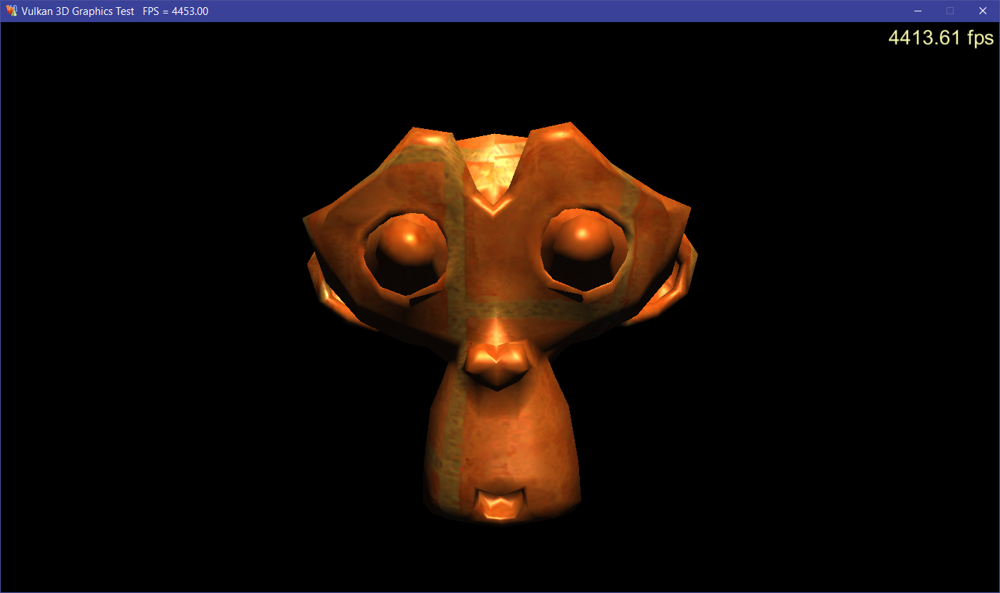
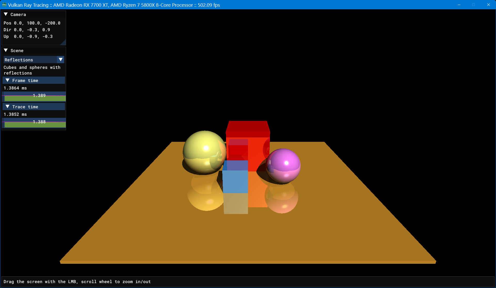

# Dlang Vulkan Graphics/Compute Library

## Requirements

- Windows
- Dlang https://dlang.org/
- Vulkan dll (Provided by video card driver)
- CImgui dll (in libs folder)
- GLFW dll (in libs folder)

## Dependencies

- dlang-common https://github.com/pvmoore/dlang-common.git
- dlang-maths https://github.com/pvmoore/dlang-maths.git
- dlang-resources https://github.com/pvmoore/dlang-resources.git
- dlang-fonts https://github.com/pvmoore/dlang-fonts.git
- dlang-logging https://github.com/pvmoore/dlang-logging.git

## GLTF Demo

This requires glTF model files from the repo at:

https://github.com/KhronosGroup/glTF-Sample-Assets.git

which is included as a submodule: external/glTF-Sample-Assets

By default this will not be cloned but you can get it by
recursively cloning:

git clone --recursive https://github.com/pvmoore/dlang-vulkan.git

Note that the submodule is > 1GB in size so only fetch it if you 
are interested in the glTF demo.
